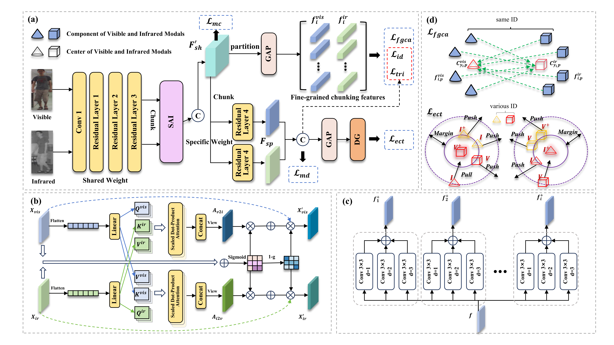

# ICASSP2026-SMCCS
Code for ICASSP 2026 Paper "Semantic Mining and Cross-Center Synergy for Cross-Modal Person Re-Identification"

## SMCCS-Net

A Simple yet effective architecture for VI-ReID. No need for fancy, complicated methods.

## :fire: NEWS :fire:

- [09/2024] **📣We submitted our paper to ICASSP 2025.**

- [09/2024] **📣We released the code.**

## Demo Picture
                                       
* (A)SMCCS-Net
  

## Installation

Run `pip install -r requirements.txt` in the root directory of the project.

## Training

* The RegDB and SYSU-MM01 datasets are publicly available, which can be find at [paper 1](https://scholar.google.com.hk/scholar?hl=zh-CN&as_sdt=0%2C5&q=+RGB-infrared+cross-modality+person+re-identification&btnG=) and [paper 2](https://scholar.google.com.hk/scholar?hl=zh-CN&as_sdt=0%2C5&q=Person+recognition+system+based+on+a+combination+of+body+images+from+visible+light+and+thermal+cameras&btnG=).

* change the data_path in ```code/train.py```.

* ```python train.py --gpu 0 --dataset sysu``` (RegDB is similarly configured).

## Contact

If you have any questions, feel free to approach me at yylv@nuist.edu.cn.

